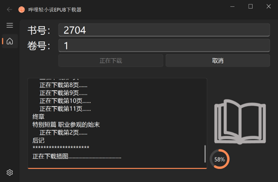
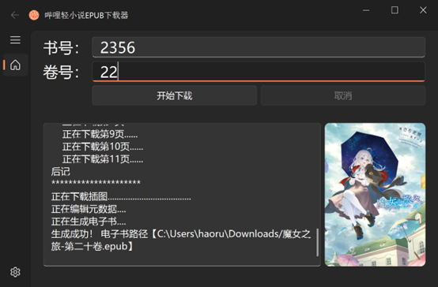

<div align="center">
   
</div>

<h1 align="center">
  &nbsp;&nbsp;&nbsp;&nbsp;&nbsp;&nbsp;&nbsp;&nbsp;&nbsp;EPUB下载器
</h1>


下载[哔哩轻小说](https://www.linovelib.com/)网站下的小说，并转化为EPUB格式，插图、目录与封面自动排版，支持各种阅读器。图形界面使用[PyQt-Fluent-Widgets](https://pyqt-fluent-widgets.readthedocs.io/en/latest/index.html)界面编写，fluent design风格，支持亮暗两种主题。

界面样例：
<div align="center">
  
  
</div>

PS：暂不支持漫画的排版，后续会开新坑专门支持漫画

## 使用前安装需要的包
```
pip install -r requirements.txt -i https://pypi.org/simple/
```
## 使用命令行模式运行:
```
python bilinovel.py
```

## 使用图形界面运行:
```
python bilinovel_gui.py
```

## 使用pyinstaller打包:
```
pyinstaller -F -w -i .\resource\logo.png --paths=C:\Users\haoru\bilinovel-download .\gui.py --clean
```

## EPUB书籍编辑和管理读软件推荐：
1. [Sigil](https://sigil-ebook.com/)
2. [Calibre](https://www.calibre-ebook.com/)

