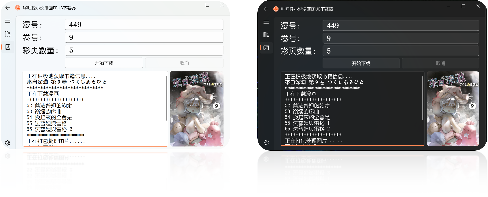

<div align="center" style="margin: 10px 0;">
  
</div>

<h1 align="center" style="margin-top: 20px;">
  哔哩轻小说和漫画EPUB下载器-Edge浏览器版
</h1>

<div align="center">
  
</div>

[哔哩轻小说](https://www.linovelib.com)与[哔哩漫画](https://www.bilimanga.net)网站小说漫画下载与EPUB打包。

特性:

* Fluent Design风格界面，下载进度与书籍封面显示，主题切换，下载目录自定义。
* 前后端分离，同时支持命令行版本。
* EPUB格式打包，支持多种阅读器。
* 支持[Kavita](https://www.kavitareader.com/)归档整理。
* 正文黑白插图和彩页插图智能排版。
* 书籍批量下载。
* 插图多线程下载。
* 访问时间间隔自定义调整。
* 缺失链接自动修复。
* 插图页不存在时手动指定彩页。
* ...................

有建议或bug可以提issue，由于软件更新频繁，可以加QQ群获得更多信息：563072544

图形界面使用[PyQt-Fluent-Widgets](https://pyqt-fluent-widgets.readthedocs.io/en/latest/index.html)界面编写。

系统要求：Windows10及以上


## 安装
### 使用前安装需要的包
```
pip install -r requirements.txt -i https://pypi.org/simple/
```
### 使用命令行模式下载小说:
```
python bilinovel.py
```

### 使用命令行模式下载漫画:
```
python bilimanga.py
```

### 使用图形界面运行:
```
python main.py
```
在主界面选择下载小说/漫画

### 使用pyinstaller打包:
```
pyinstaller -F -w -i .\resource\logo.png -n bili-download .\main.py
```

## 相关项目：

* [轻小说文库EPUB下载器](https://github.com/ShqWW/lightnovel-download)

* [哔哩轻小说EPUB下载器](https://github.com/ShqWW/bilinovel-download)

* [拷贝漫画EPUB下载器](https://github.com/ShqWW/copymanga-download)


## EPUB书籍编辑和管理工具推荐：
1. [Sigil](https://sigil-ebook.com/) 
2. [Calibre](https://www.calibre-ebook.com/)
3. [Kavita](https://www.kavitareader.com/)

